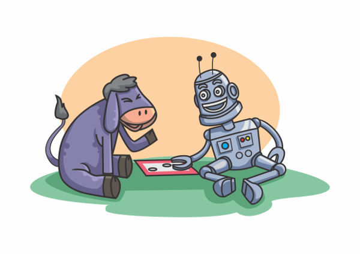

Mule
=======
**Turn-Based Game Platform featuring Asyncronous Multiplayer Gameplay**



Roadmap to 0.1.0 / Milestones:
- I - Users/Games
- II - Concept of RuleBundles added
- III - GameBoard (Spaces' and Pieces)
- IV - Turn System
- V - Action System Experiments (TicTacToe, MuleSprawl, Backgammon)
- VI - RuleBundle API
- VII - Huge Cleanup / Refactor Month  <--CURRENT
- VIII - AI
- IX - Database Abstraction Layer
- X - Scalability

Latest commit on master hosted at (CI staging):
- MuleFrontend: http://zion.tgp.io:313/
- Old/Debug: http://zion.tgp.io:313/webservices/public/

Looking for a more mature solution, check out our competition:
---------
- Boardgame.io: https://github.com/nicolodavis/boardgame.io
- Nakama: https://github.com/heroiclabs/nakama

INSTALL:
=======

Node (Ubuntu):
-----------
```
    sudo apt-get update
    sudo apt-get install -y python-software-properties python g++ make
    sudo add-apt-repository ppa:chris-lea/node.js
    sudo apt-get update
    sudo apt-get install nodejs
```

Grunt, forever:
-----------
```
    sudo npm install -g grunt-cli pm2
```

Dev Tools:
-----------
```
    sudo npm install -g node-inspector mocha jscs jshint
```

MongoDB:
-----------
- http://docs.mongodb.org/manual/installation/
OR
- http://docs.mongodb.org/manual/tutorial/install-mongodb-on-linux/
- put mongo folder in '~/mongodb'
- run 'grunt monGO' to start mongodb

Install ProjectMule
-----------
```
    npm install
    grunt updateMule
```

Nginx Config
-----------

  - Ubuntu: /etc/nginx/nginx.conf

RUN:
=======
To run as a background process using pm2 (```sudo npm install pm2 -g```)
```
    npm start
```
or
```
    node server.js
```

TESTS:
=======
```
(cd ./test && ./installGames.sh)  # or ./updateGames.sh
npm test
```

DEV:
=======

Develop `mule-utils` & `mule-models` repo's from mule `node_module/mule-*` directory

Grunt Tasks
-----------

Grunt tasks use git (authed through ssh)

`grunt updateMule` - clears `./node_modules` and re-npm-install's dependencies. mule-utils & mule-models is git cloned into node_modules
`grunt updateUtils` - clears `./node_modules/mule-models/node_modules/mule-utils` and re-git-clones `mule-utils`

`grunt monGO` - starts mongodb daemon
